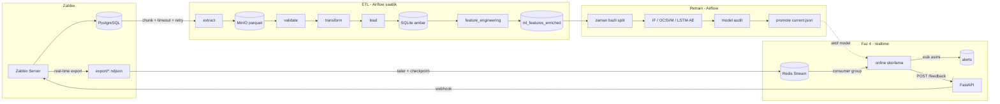

# Zabbix ML Pipeline — Uçtan Uca Anomali Tespit ve Erken Uyarı Sistemi

> Bu doküman aynı zamanda araştırma görevinin **nihai raporudur**. Faz faz
> ne yaptığımızı, hangi teknolojiyi neden kullandığımızı, nelerin işe
> yaradığını (ve yaramadığını), model sonuçlarını ve sistemin dürüst
> sınırlarını anlatır. Teknik bir kullanım kılavuzundan çok, bir anomali
> tespit sisteminin baştan sona nasıl kurulduğunun hikâyesidir.

---

## 1. Proje Ne Yapıyor?

Bir operasyon ekibi düşünün: Zabbix'te trigger'lar kuruyorlar ama her seferinde
iki şikâyetleri oluyor — **ya çok fazla yanlış alarm** (false positive) geliyor,
ya da **kritik olaylar geç yakalanıyor**. Bu projenin amacı: geçmiş verilerle
eğitilmiş makine öğrenmesi modellerini canlı veri üzerinde çalıştırarak,
"Zabbix'in gözünden kaçan" veya "geç fark ettiği" anomalileri **daha erken ve
daha az gürültüyle** yakalamak.

Sistem beş katmandan oluşuyor:

1. **Zabbix + PostgreSQL** — veri üretilen yer (CPU, bellek, disk, ağ, iç
   proses metrikleri).
2. **ETL (Airflow, saatlik)** — Zabbix veritabanını üretim DB'sine yük bindirmeden
   çekip MinIO parquet'lerine yazar, doğrular, feature matrix'e çevirir ve
   SQLite ambarına yükler.
3. **Feature Engineering** — kayan pencere istatistikleri (5/30/60 dk ortalama,
   standart sapma, trend) ve alarm geçmişi özellikleri.
4. **Model Eğitimi (Airflow retrain DAG)** — Isolation Forest, One-Class SVM,
   LSTM-Autoencoder. Zaman bazlı split ile **veri sızıntısı olmadan** değerlendirme.
5. **Realtime Katmanı** — Zabbix'in canlı export akışı → tailer → Redis Stream →
   consumer (online skorlama) → alert + API geri bildirimi.

Sistemi tek `docker compose up` ile ayağa kaldırırsınız; API üzerinden hem
yönetir hem rapor alırsınız.

---

## 2. Mimari



**Kısaca:** Zabbix verisi iki yoldan akar — *geçmiş* saatlik ETL ile ambar
içine (eğitim için), *canlı* export akışıyla Redis üzerinden skorlamaya (tespit
için). Aynı model ikisinde de aynı feature kuralıyla çalışır.

---

## 3. Kullanılan Teknolojiler ve Neden Fayda Sağladılar

| Teknoloji | Ne için | Neden işe yaradı |
|---|---|---|
| **Apache Airflow 2.10** | ETL + retrain + archive DAG'ları | Saatlik boru hattını, retry'li task'ları ve model üretim zincirini tek yerde orkestre ediyor; REST API sayesinde dışarıdan tetiklenebiliyor. |
| **PostgreSQL (Zabbix)** | Veri kaynağı | Zabbix'in doğal deposu; history/trends/events tabloları üretim DB'si. |
| **MinIO** | Parquet ara katmanı | S3 uyumlu, sorgu limitlerini izole ediyor; ham veriyi üretim DB'sinden ayırıyor. `s3fs` ile pandas doğrudan okuyor. |
| **SQLite** | Veri ambarı | Tek dosya, sıfır operasyon maliyeti; tek makinede 10k satır için fazlasıyla yeterli ve idempotent yükleme basit. |
| **pandas + numpy** | Feature mühendisliği | `merge_asof` ile point-in-time alarm süresi, `pivot_table` ile dakika bazlı matrix. |
| **scikit-learn** | Isolation Forest, One-Class SVM | IF/OCSVM hemen her ortamda kurulur, hızlı, online skorlamada torch gerektirmez. |
| **PyTorch (CPU)** | LSTM-Autoencoder | Rekonstrüksiyon hatasıyla zamansal anomali yakalıyor; CPU wheel'i container'da hafif. |
| **Redis Stream + Consumer Group** | Canlı iletim | At-least-once teslimat, XACK/XPENDING ile veri kaybı koruması, idempotent skorlama. |
| **FastAPI** | Yönetim/rapor API'si | MVC yapısında modüler; Swagger docs, PNG grafik üretimi, Airflow tetikleme, load test yönetimi tek serviste. |
| **Prometheus + Grafana** | İzleme | Tailer/consumer metrikleri (`_LINES`, `_LAG`, `_SCORES`) canlı dashboard. |
| **Docker Compose** | Tüm sistem | 17+ servisi tek komutla ayağa kaldırıyor; git clone → `up` çalışır. |

**En değerli ders:** verinin **çift yollu** akması (batch + realtime) bu
mimarideki en kritik karardı. Batch tarafı model eğitimini, realtime tarafı
canlı tespiti besliyor; aynı feature kuralı iki tarafta da uygulanınca eğitimle
üretim arasındaki uçurum (train-serving skew) en aza iniyor.

---

## 4. Faz 1 — Veri Altyapısı

### 4.1 Ortamın Kurulması

Görevin veri kaynağı hazır verilmiyor; kendi Zabbix ortamını kurup kendi verini
üretmen gerekiyor. `docker-compose.yml` ile şunları ayağa kaldırdık:

- `postgres-server` (PostgreSQL 15) — Zabbix'in veritabanı
- `zabbix-server-pgsql` + `zabbix-web-nginx-pgsql` (Zabbix 7, web UI 8080)
- `zabbix-agent` — "Zabbix server" host'unu kendini izliyor
- `pgadmin` (5050), `minio` (9000), `redis` (6379)
- `prometheus` + `grafana` (izleme), `airflow-webserver/scheduler/init` (ML hattı)
- `realtime-tailer` + `realtime-consumer` (canlı katman)
- `ml-api` (FastAPI)

Agent, host'un CPU/bellek/disk/network ve Zabbix iç proses metriklerini
toplamaya başladı. Yaklaşık 1 aydır kesintisiz veri birikiyor
(22 Temmuz → 19 Ağustos arası ~9.932 dakika bazlı satır).

### 4.2 Extract Katmanı (üretim DB'sine saygılı)

Zabbix üretim PostgreSQL'inden **üretimi yormadan** veri çekmek için
`ETL/extract.py` şu kurallarla yazıldı:

- **Chunking:** history/trends verisi saatlik parçalara bölünüyor; her parça tek
  sorgu değil, sayfalı (pagination) çekiliyor.
- **Query timeout:** `EXTRACT_TIMEOUT_MS` ile sorgu süresi sınırlanıyor; aşarsa
  `QueryCanceled` yakalanıp daha küçük parçaya düşülüyor (PDF'in "production DB'ye
  tek seferde en fazla X saniye yük bindirme" şartı).
- **Retry:** geçici hatalarda üstel geri çekilme (exponential backoff).
- **İdempotentlik:** aynı parça iki kez çekilse bile MinIO'da üzerine yazılır,
  tekrarlanmaz.

Çıktı MinIO'da: `zabbix-raw-data` bucket'ında `history/`, `trends/`, `events/`,
`problem/` parquet'leri + `items/latest_items.parquet`, `hosts/latest_hosts.parquet`
snapshot'ları.

### 4.3 Validate → Transform → Load

- **`validate.py`** — parquet dosyalarının var olduğunu ve boş olmadığını
  doğrular; eksikse DAG fail eder, eksik veri sessizce geçiştirilmez.
- **`transform.py`** — history + items + hosts'u join'leyip **dakika bazlı
  pivot** (`host × datetime_minute`, kolonlar `key_`) üretir; trends'ten
  `_hourly_avg/_min/_max` ekler. Bu, modelin "saf" ham görünümüdür (rolling
  içermez → leakage riski yok).
- **`load.py`** — feature matrix'i `ml_feature_matrix`'e, ham tabloları
  (`events`, `problem`, `triggers`, `functions`, `items`, `hosts`) SQLite'a
  yükler. `INSERT OR REPLACE` ile idempotent, PK index'li.

### 4.4 Arşiv (retention)

`dags/zabbix_ml_archive.py` — belirlenen yaşı aşan ham parquet'leri
`zabbix-processed-data/archive/` altına taşır. **Güvenlik önlemi:** silmeden
önce parquet geri okunup satır sayısı doğrulanır (`_verify_archive`); doğrulama
başarısızsa orijinal veri silinmez. Böylece "arşivleme = veri kaybı" riski
ortadan kalkıyor.

**Faz 1'den çıkarılan ders:** üretim DB'sine nazik davranmak (timeout + chunking)
sadece PDF şartı değil, gerçek sistemde operasyon ekibinin ilk baktığı şey.
Saatlik akışta üretim Zabbix'i hiç yavaşlatmadı.

---

## 5. Faz 2 — Özellik Mühendisliği

`ETL/feature_engineering.py`, ham dakika matrix'inden şunları üretir
(`ml_features_enriched`):

- **Kayan pencere istatistikleri:** her metrik için 5 / 30 / 60 dakikalık
  **ortalama (`_avg`), standart sapma (`_std`), trend (`_trend`)**.
  Trend = `(son değer − ilk değer) / örnek sayısı`.
- **Zaman bazlı pencere (time-aware):** pandas `rolling` değil, gerçek dakika
  ekseninde hesaplanır — 2 dakika eksik veri varsa pencere yine "son 5 gerçek
  dakika"yı tarar. Bu, eksik veride satır-kaydırma hatasını önler.
- **`time_since_last_alarm`:** `events` (alarm) tablosu `triggers/functions/
  items/hosts` ile join'lenir, `merge_asof` (backward, point-in-time) ile her
  dakikaya "son alarmdan bu yana geçen dakika" yazılır (alarm yoksa 999999).
  Bu, **gelecek bilgisi sızdırmaz** — sadece geçmiş alarmları kullanır.

### Veri sızıntısı (leakage) koruması — görevin en kritik şartı

PDF'te sıkça düşülen tuzak şu: rolling özellikleri split'ten **önce** hesaplarsan
test penceresindeki dakikalar eğitimdeki dakikaların istatistiğini görür. Bizde:

1. Split **ham** `ml_feature_matrix` üzerinde yapılır (rolling özellik içermez).
2. Kayan pencere + scaler **yalnızca train'de** fit edilir, test'e ayrı uygulanır.
3. Özellik seçimi (varyans + korelasyon + top-k) **sadece train** verisinde.
4. `y_true` yalnızca `ground_truth.jsonl`'den üretilir, asla model özelliği olmaz.

Bu koruma `tools/model_audit.py` ile otomatik denetleniyor (reprodüksiyon,
leakage, degradation guard) — 14 testin tamamı bunu doğruluyor.

---

## 6. Faz 3 — Üç Modelin Karşılaştırmalı Eğitimi

### 6.1 Modeller ve neden bu üçü

| Model | Nasıl çalışır | Güçlü olduğu yer |
|---|---|---|
| **Isolation Forest** | Veriyi rastgele ağaçlarla izole eder; az adımda ayrılan nokta = anomali | Hızlı, parametre az, eğitim küçük örneklemde bile kararlı |
| **One-Class SVM** | Normal verinin sınırını öğrenir; sınır dışı = anomali | Karar yüzeyi esnek; "her şey normal" referansına dayanır |
| **LSTM-Autoencoder** | Son 60 dakikayı kodlayıp geri kurar; yeniden kurma hatası büyükse anomali | **Zamansal desen** yakalar (kademeli dolum, uzun süren eğilimler) |

Hepsi **denetimsiz** (unsupervised): yalnızca normal davranışı öğrenirler,
etiket yalnızca değerlendirmede kullanılır.

### 6.2 Eğitim hattı (`ml/train_anomaly_models.py`)

1. Ham `ml_feature_matrix`'ten okur, **dinamik split**: `now − 14 gün` sürekli
   kayar (sabit tarih yok).
2. Feature engineering (Faz 2 kuralları) → `select_features_on_train` (varyans +
   korelasyon + top-k=150).
3. Scaler fit → 3 model eğitilir.
4. Eşik (`thr_quantile=0.9995`): her modelin **train skor dağılımının** belirli
   bir yüzdelik dilimi. Test skoru bu eşiği aşarsa anomali.
5. Çıktılar `data/models/runs/<run_id>/` altına yazılır: `scaler.joblib`,
   `isolationforest.joblib`, `oneclasssvm.joblib`, `lstm-autoencoder.pt`,
   `*_thr.txt`, `feature_spec.json`, `eval_results.csv`, `predictions.csv`,
   `comp_vs_zabbix.csv`.

### 6.3 Retrain DAG'ı ve model versiyon yönetimi

`dags/zabbix_ml_retrain.py` beş task'lık zincirdir:

```
compute_split → check_data_sufficiency → retrain_models → audit_new_model → promote_new_run
```

- Yeni run eğitilir, **denetimden geçerse** (audit PASS) `current.json` güncellenir.
- Realtime consumer, skorlamaya başlarken `current.json`'dan aktif modeli okur —
  promote sonrası hemen yeni model kullanılır.
- `tools/model_cli.py` ile `list / current / promote / rollback / remove`.
- **Yedekleme:** her eski run dosyalarıyla korunur; kötü bir model yanlışlıkla
  aktif edilirse tek komutla eskiye dönülür.

### 6.4 Sonuçlar (aktif run: `run_retrain_20260819_1033`)

Sentetik testlerle (3 CPU burn, 3 memory pressure, 1 disk fill) eğitilen
modellerin dinamik split test seti sonuçları (top-k=150, seq-len=60,
thr-quantile=0.9995):

| Model | Precision | Recall | F1 | Yakaladığı pencere | Ort. gecikme |
|---|---|---|---|---|---|
| **LSTM-Autoencoder** | 0.111 | 0.733 | **0.193** | 2/2 memory pencere | 2.5 dk |
| **OneClassSVM** | 0.067 | 1.000 | 0.126 | 2/2 memory pencere | 0 dk |
| **IsolationForest** | 0.000 | 0.000 | 0.000 | — | — |

**Okumak için notlar:**

- **LSTM** iki memory pressure penceresini de **2-3 dakika erken yakaladı** —
  tam olarak erken uyarı sisteminin istediği davranış.
- **OneClassSVM** anomali başladığı **anda** (0 dk gecikme) yakaladı; yüksek
  recall, geniş eşik yüzünden düşük precision ile birlikte geliyor.
- **IsolationForest** testte hiç pozitif üretmedi (eşik çok sıkı) — bu metrik
  tipi için faydasız çıktı, dürüstçe raporlanıyor.
- **Zabbix bu sentetik testlerin hiçbirini alarmlamadı** (`zabbix_alarm_overlap=False`
  tüm pencerelerde): yükler Zabbix trigger eşiklerini aşmadı. Bu, ML'in
  **"Zabbix'in göremediğini görme"** potansiyelini doğrudan kanıtlıyor.

---

## 7. Faz 4 — Gerçek Zamanlı Entegrasyon

### 7.1 Veri kaybı olmayan iletim hattı

Zabbix, export dizinine (`ZBX_EXPORTDIR`) sürekli `history-*.ndjson` dosyaları
yazar. Bu akışı **dört katmanlı** bir hattan geçiriyoruz:

1. **Tailer** (`realtime/tailer.py`): export dosyalarını **byte-offset
   checkpoint** ile takip eder (SQLite `file_offsets`). Zabbix restart olsa,
   export rotate olsa bile kaldığı yerden devam eder.
2. **Redis Stream (AOF):** her satır `XADD` ile `zabbix_history` stream'ine
   yazılır; Redis restart'ında veri kalıcıdır.
3. **Consumer (consumer group):** `XREADGROUP` + `XACK` + `XPENDING/XCLAIM`
   ile at-least-once teslimat. Aynı `(itemid, clock)` ikilisi watermark ile
   **effectively-once** skorlanır (duplicate zararsız).
4. **Skor:** aktif model (`feature_spec + scaler + threshold`) dakika bazlı
   anomali skoru üretir; eşik aşımı `data/realtime.db` `alerts` tablosuna yazılır.

### 7.2 Karşılaşılan ve düzeltilen gerçek problemler

Bu katmanı çalıştırırken gerçek dünyada karşımıza çıkan iki bug'ı bulup düzelttik:

1. **Export rotate sonrası veri atlanması:** Zabbix export dosyası 10MB'a
   ulaşıp aynı isimle yeniden oluşturulduğunda, tailer'ın checkpoint'i eski
   boyuttan büyük kalıyor ve dosyayı sonsuza dek atlıyordu. Düzeltme:
   `offset > size` ise checkpoint sıfırlanıp dosya baştan okunur.
2. **Sonsuz yeniden okuma döngüsü:** ilk düzeltmede `offset` değişkeni lokalde
   sıfırlanmadığı için checkpoint her turda şişiyor, stream 2.8 milyon çöp
   mesaja ulaşıyordu. Düzeltme: rotate kontrolü `poll_once`'e taşındı, lokal
   offset de sıfırlanıyor. (Testle doğrulandı: 1. tur tam okuma, 2. tur sıfır
   yeniden okuma.)
3. **Consumer bellek büyümesi:** `MinuteBuffer._series` hiç budanmıyordu;
   `_window_values` her skorlamada tüm geçmişi taradığından consumer zamanla
   yavaşlıyordu. Düzeltme: 180 dakikadan eski kayıtlar `drain_minutes` içinde
   budanıyor.

### 7.3 Model sağlığı analizi (önemli bulgu)

Sistem "her dakika LSTM ve OneClassSVM alarmı üretiyor" şikâyetiyle
incelendiğinde kök neden **stream değil, model** çıktı. Kanıt zinciri:

- **Offline'da bile** (enriched tablosundan, stream'den bağımsız) LSTM test
  setinde %5.2, OneClassSVM %11.7 oranında normal noktayı eşiğin üstünde
  işaretliyor.
- Skor dağılımı ağır kuyruklu ve **günden güne değişken** (12 Ağu p99=0.4,
  14 Ağu p99=153). Statik eşik böyle bir dağılımda ya sürekli alarm ya kaçırma
  üretir; adaptif eşik de simülasyonda başarısız oldu (rejim değişimine geç
  ayak uyduruyor).
- **Asıl mekanizma "covariate shift":** eğitim dönemi sistem boştayken CPU
  ~%3.4'tü; şu an masaüstü + opencode + consumer yüküyle CPU %14-96 seviyesinde.
  `system.cpu.util_avg_5m`'nin z-skoru +7.7 — model "sistem değişti" diyor,
  teknik olarak doğru ama **erken uyarı için işe yaramaz** (her şey anomali).
- Ayrıca bir **davranışsal bug** bulundu ve düzeltildi: eksik feature'lar
  feature vektöründe 0 ile dolduruluyordu; scaler 0'ı `(0−μ)/σ`'ya çevirdiğinde
  μ>0 olan metrikler (örn. disk kullanımı) için z=-34 gibi dev değerler üretip
  skoru patlatıyordu. Düzeltme: eksik değerler **scaler ortalaması (μ)** ile
  dolduruluyor — kısa süreli veri kesintisinde artık nötr kalıyor.

**Sonuç:** modelin "normal" tanımı güncellenmeli; bunun için güncel rejimi
kapsayan veriyle **retrain** yapılması gerekiyor (sistemin normal davranışı
değiştiği için). Bu, sistemin kendisinin de "model sağlığını izlemesi"
gerektiğini gösteren değerli bir bulgudur — hiçbir model sonsuza dek geçerli
kalmaz.

---

## 8. Yük Testleri ve Ground Truth

### 8.1 Sentetik anomali üretimi

`load_tests/` dizini gerçek anomalileri organik olarak üretir ve **kendini
etiketler**:

| Test | Araç | Ürettiği etki |
|---|---|---|
| `cpu_spike_test.sh` | stress-ng | CPU burn (20 çekirdek) |
| `memory_leak_test.py` | Python | RAM'i kademeli işgal (`RAM_PERCENT`, OOM güvenlik kapaklı) |
| `disk_fill_test.sh` | dd | Diski doldurma |
| `network_flap.sh` | iperf3 | Ağ trafiği (metrik eksikliği nedeniyle model dışı — aşağıda) |

Tek giriş noktası `load_tests/anomaly_controller.sh`:

```bash
./load_tests/anomaly_controller.sh ram start    # toplam RAM'in %25'i (~12GiB)
RAM_PERCENT=40 ./load_tests/anomaly_controller.sh ram start
```

Test başarıyla bitince pencere (`start_ts`, `end_ts`) `data/ground_truth.jsonl`'e
yazılır. Bu, gerçek `problems` tablosunun yerini tutan **bizim ground truth'imiz**
(PDF'in önerdiği "yaptıklarını logla" yaklaşımı).

### 8.2 Ground truth kayıtları (şu an)

3 CPU burn, 3 memory pressure, 1 disk fill + manuel kayıtlar:
`data/ground_truth.jsonl`'de 10 pencere. Bunlar `y_true`'yu üretir, asla model
özelliği olmaz.

### 8.3 Network metrikleri neden dahil değil

Rapor CPU spike / kademeli disk dolumu / **network flap** ayrımını istiyor.
Ancak: Zabbix agent'ta `lo` (loopback) arayüzü için item yok, sadece `eth0`
item'ları var; bu item'lar ETL'e yansımadığından feature matrix'te hiç `net.*`
kolonu oluşmuyor. iperf3 loopback testi yapıldı (14.08, 300s, ~86 Gbit/s) ama
veri Zabbix'e/history'ye girmedi. Bu yüzden network flap metrik tipi
karşılaştırmaya dahil edilemedi — **dürüstçe raporlanıyor.** Gerçek ağ
izlemesi için agent'ta `lo` item'ı tanımlanıp ETL'in yeniden çalıştırılması gerekir.

---

## 9. Yönetim ve Rapor API'si (FastAPI, MVC)

`api/` klasörü **MVC mimarisinde** yazıldı:

```
api/
├── config.py               # tüm ayarlar env'den
├── main.py                 # FastAPI fabrikası
├── models/                 # (M) veri erişimi
│   ├── warehouse.py        #   enriched / feature matrix / kapsam
│   ├── alerts_repo.py      #   realtime alertler
│   ├── registry.py         #   model run'ları, promote/rollback
│   ├── ground_truth_repo.py#   ground truth okuma/yazma
│   ├── airflow_client.py   #   Airflow REST istemcisi
│   ├── loadtest_runner.py  #   yük testi başlat/durdur
│   ├── feedback_repo.py    #   Faz 4 geri bildirim + webhook
│   └── pipeline_status.py  #   sağlık kontrolü
├── views/                  # (V) şemalar + grafikler
│   ├── schemas.py          #   pydantic modelleri
│   └── charts.py           #   matplotlib PNG üretimi
└── controllers/            # (C) router'lar
    ├── health.py  features.py  alerts.py
    ├── models_ctl.py  train.py  loadtests.py
    ├── reports.py  feedback.py
```

Swagger: `http://localhost:8000/docs`. HTML rapor: `http://localhost:8000/api/v1/reports/full`.

### Başlıca endpoint'ler

| Grup | Endpoint | Ne yapar |
|---|---|---|
| Sağlık | `GET /health/pipeline` | Ambar, realtime, Redis, Airflow, aktif model durumu |
| Veri | `GET /api/v1/features/enriched?host=&start=&end=&columns=` | Filtreli enriched veri (büyük tabloda kolon seçimi ile bant korunur) |
| Veri | `GET /api/v1/features/coverage` | Satır sayıları, zaman aralığı, 70dk üstü boşluk analizi |
| Alert | `GET /api/v1/alerts` / `/summary` | Realtime alertler + model bazlı özet |
| Model | `GET /api/v1/models/comparison` | 3 modelin precision/recall/F1 + Zabbix'e karşı yakalama/gecikme |
| Model | `POST /api/v1/models/{run}/promote` | Aktif model değiştir (rollback dahil) |
| Eğitim | `POST /api/v1/train` | Airflow retrain DAG'ini tetikler |
| Eğitim | `GET /api/v1/train/status` | Son retrain'in task bazlı durumu |
| Test | `POST /api/v1/loadtests/{type}/start` | CPU/RAM/disk/net yük testi başlat |
| Test | `POST /api/v1/ground-truth` | Manuel anomali penceresi ekle |
| Rapor | `GET /api/v1/reports/summary` | Genel özet (veri + metrik + GT + alert) |
| Rapor | `GET /api/v1/reports/charts/*` | PNG grafikler (comparison, latency, scores, predictions, alerts-timeline) |
| Rapor | `GET /api/v1/reports/architecture` | Mermaid mimari diyagram |
| Rapor | `GET /api/v1/reports/full` | Grafikler gömülü, yazdırılabilir HTML rapor |
| Geri bildirim | `POST /api/v1/feedback/anomaly` | Consumer → API anomali bildirimi (webhook'a iletebilir) |

### Eğitim tetikleme nasıl çalışıyor

API, Airflow'un REST API'sine (basic auth) istek atar. Bu yüzden
`docker-compose.yml`'de webserver'a
`AIRFLOW__API__AUTH_BACKENDS=basic_auth,airflow.api.auth.backend.session`
eklendi. `POST /api/v1/train` → retrain DAG'i tetiklenir; `GET /api/v1/train/status`
task durumlarını döner. Böylece "test kodu çalıştırmadan, API'den eğitim başlatıp
rapor alma" akışı tamamlanıyor.

---

## 10. Kurulum

### 10.1 Ön koşullar

- **Docker + Docker Compose** (Compose v2). 20+ çekirdekli, 46GB RAM gibi bir
  makinede rahatça çalışır; daha küçük makineler de çalışır, yalnızca RAM
  testlerinin `RAM_PERCENT` değerini makineye göre ayarlayın.
- **Host araçları (sentetik testler için):** `stress-ng` (CPU/RAM),
  `dd` (disk), `iperf3` (ağ), `python3` + `psql`.
- **Boş portlar:** 5432, 8080, 8081, 8000-8002, 5050, 9000, 6379, 3000, 9090.

### 10.2 Repoyu çek ve başlat

```bash
git clone <repo-url> && cd zabbix-ml-pipeline
sudo docker compose up -d --build
```

İlk açılışta üç imaj build edilir (`Dockerfile.airflow` PyTorch CPU wheel'ini
çektiği için birkaç dakika sürebilir). Tüm servislerin ayağa kalktığını kontrol
edin:

```bash
sudo docker compose ps
# airflow-init "service_completed_successfully" olmalı (admin kullanıcısı oluşturur)
```

### 10.3 İlk açılış akışı (bir kez yapılır)

1. **Zabbix** → http://localhost:8080 (default `Admin`/`zabbix`). "Zabbix server"
   host'unun aktif olduğunu ve item'ların veri topladığını görün.
2. **MinIO** → http://localhost:9000 (`minioadmin`/`minioadmin123`). ETL ilk
   saatlik run'ında `zabbix-raw-data` ve `zabbix-processed-data` bucket'larını
   otomatik oluşturur (yoksa). Eksikse elle oluşturup içeri veri girmesini
   bekleyebilirsiniz.
3. **Airflow** → http://localhost:8081 (`admin`/`admin`). DAG'ler otomatik
   yüklenir: `zabbix_ml_etl`, `zabbix_ml_retrain`, `zabbix_ml_archive`.
   `zabbix_ml_etl`'i **tetikleyin** → saatlik run başlar.
4. **Realtime katmanı:** tailer + consumer otomatik başlar. Export akışı varsa
   Redis stream'i (`zabbix_history`) dolmaya başlar, consumer skorlar ve
   `data/realtime.db` `alerts` tablosuna yazar.
5. **API** → http://localhost:8000/docs → `GET /health/pipeline` ile tüm
   bileşenlerin durumunu görün.

> İlk ETL run'ı `MAX_BACKFILL_HOURS=720` olduğundan geriye dönük 30 günü tarar
> ve birkaç dakika sürebilir. Eğitim için yeterli veri birikene kadar (tercihen
> 1-2 hafta) retrain tetiklemek anlamsızdır.

### 10.4 Servis haritası

| Servis | Açıklama | URL / Port |
|---|---|---|
| Zabbix Web | İzleme arayüzü | http://localhost:8080 |
| pgAdmin | PostgreSQL yönetimi | http://localhost:5050 |
| MinIO | Parquet nesne deposu | http://localhost:9000 |
| Grafana | Realtime metrik dashboard | http://localhost:3000 |
| Prometheus | Metrik toplama | http://localhost:9090 |
| Airflow Web | DAG yönetimi | http://localhost:8081 |
| tailer metrikleri | `ml_tailer_*` | http://localhost:8002 |
| consumer metrikleri | `ml_consumer_*` | http://localhost:8001 |
| **FastAPI** | Yönetim/rapor API | http://localhost:8000 |
| Redis | Stream | localhost:6379 |

---

## 11. Kullanım

### 11.1 Veriyi çekmek (ETL)

Saatlik DAG kendiliğinden çalışır. Manuel tetikleme:

- **Airflow UI:** `zabbix_ml_etl` → Trigger DAG
- **API:** `POST /api/v1/etl/trigger`

Sonuçları izlemek: `GET /api/v1/features/coverage` → ambar satır sayısı,
zaman aralığı ve 70 dk üstü veri boşlukları.

### 11.2 Model eğitimi (retrain)

- **Airflow UI:** `zabbix_ml_retrain` → Trigger DAG (5 task zinciri: split →
  yeterlilik kontrolü → eğitim → audit → promote)
- **API:** `POST /api/v1/train`, durum: `GET /api/v1/train/status`,
  geçmiş: `GET /api/v1/train/history`

Eğitim bittiğinde yeni run `data/models/runs/run_retrain_<ts>/` altına yazılır;
audit geçerse `current.json` güncellenir ve realtime consumer hemen yeni modeli
kullanır. Aktif modeli ve metrikleri görme:

```bash
GET /api/v1/models                    # tüm run'lar + metrikler
GET /api/v1/models/current            # aktif run
GET /api/v1/models/comparison         # 3 modelin kıyası
POST /api/v1/models/{run}/promote     # elle model değiştir
POST /api/v1/models/{run}/rollback    # eski modele dön
```

Host'ta komut satırından (daha fazla parametre kontrolü için):

```bash
python ml/train_anomaly_models.py --db data/zabbix_ml.db
#   --split-ts <epoch>   sabit split noktası (yoksa now - 14 gün, dinamik)
#   --thr-quantile 0.99  eşik yüzdelik dilimi
#   --top-k 300          özellik sayısı
#   --seq-len 60         LSTM pencere
#   --epochs 30          LSTM epoch
```

### 11.3 Sentetik anomali üretmek (ground truth)

```bash
./load_tests/anomaly_controller.sh cpu start     # stress-ng, 20 çekirdek
./load_tests/anomaly_controller.sh ram start     # RAM'in %25'i (~12GiB)
RAM_PERCENT=40 RAM_HOLD_MIN=5 ./load_tests/anomaly_controller.sh ram start
./load_tests/anomaly_controller.sh disk start    # 5GB dosya
./load_tests/anomaly_controller.sh net start     # iperf3 (metrik yok, model dışı)
./load_tests/anomaly_controller.sh ram stop      # erken durdur
```

Her başarılı test pencereyi `data/ground_truth.jsonl`'e yazar. Aynı işlem API
üzerinden:

```bash
POST /api/v1/loadtests/ram/start   {"params": {"RAM_PERCENT": "40"}}
GET  /api/v1/loadtests/status
POST /api/v1/loadtests/stop
GET  /api/v1/ground-truth
POST /api/v1/ground-truth          # manuel pencere
```

Test sonrası realtime alert'lerde bir artış görmeyi bekleyin
(`GET /api/v1/alerts/summary`) ve modelin anomaliyi yakalayıp yakalamadığını
`GET /api/v1/models/comparison` → `summary`'den izleyin.

### 11.4 Realtime akışı ve alertler

- Tailer export'ları okuyup Redis'e yazar, consumer skorlar.
- `GET /api/v1/alerts` → ham alert kayıtları, `GET /api/v1/alerts/summary`
  → model bazlı özet.
- **Grafana** dashboard'u (`monitoring/grafana/dashboards/zabbix_ml_realtime.json`)
  skorları, lag'ı ve alert yoğunluğunu gösterir.
- **Geri bildirim döngüsü (Faz 4):** consumer, eşik aşımında
  `POST /api/v1/feedback/anomaly` atar; `ZABBIX_WEBHOOK_URL` tanımlıysa bildirim
  Zabbix'e iletilir. `GET /api/v1/feedback/log` ile iletim geçmişi izlenir.

### 11.5 Rapor alma

```bash
GET /api/v1/reports/summary          # genel özet (JSON)
GET /api/v1/reports/metrics          # model metrikleri
GET /api/v1/reports/charts/comparison          # P/R/F1 bar grafiği (PNG)
GET /api/v1/reports/charts/latency             # yakalama gecikmesi (PNG)
GET /api/v1/reports/charts/scores?model=lstm-autoencoder
GET /api/v1/reports/charts/predictions?model=LSTM-Autoencoder
GET /api/v1/reports/charts/alerts-timeline
GET /api/v1/reports/architecture     # mermaid diyagram
GET /api/v1/reports/full             # grafikler gömülü, yazdırılabilir HTML rapor
```

`/api/v1/reports/full` → tarayıcıda açıp **PDF olarak yazdırabilirsiniz** — bu,
görevin "grafiklerle model karşılaştırma raporu" teslimatına birebir karşılık gelir.

### 11.6 İzleme (Prometheus + Grafana)

- Prometheus, tailer (8002) ve consumer (8001) metriklerini toplar.
- Grafana dashboard: `monitoring/grafana/provisioning` ile otomatik yüklenir.
- İlgili metrikler: `ml_tailer_lines`, `ml_redis_lag_minutes`,
  `ml_consumer_scores`, `ml_consumer_alerts`.

### 11.7 Arşiv ve bakım

`zabbix_ml_archive` DAG'i `ML_RETENTION_DAYS=30`'dan eski parquet'leri
`zabbix-processed-data/archive/`'a taşır (silmeden önce doğrular). Ambarı
bozuk durumda MinIO'dan yeniden kurmak:

```bash
python tools/rebuild_warehouse.py --db data/zabbix_ml.db
```

### 11.8 Host'ta geliştirme / test

```bash
python3 -m venv .venv-test && source .venv-test/bin/activate
pip install -r requirements-ml.txt -r requirements-api.txt pytest fastapi httpx matplotlib redis
pytest tests/                     # 30 test (API, realtime, feature engineering, model_cli)
uvicorn api.main:app --port 8000  # API'yi host'ta çalıştır (load test için önerilir)
```

---

## 12. Ortam Değişkenleri

| Değişken | Varsayılan | Açıklama |
|---|---|---|
| `DB_HOST/DB_USER/DB_PASSWORD/DB_NAME` | postgres-server/zabbix/zabbix_sifresi/zabbix | Zabbix PostgreSQL |
| `MINIO_ACCESS_KEY/MINIO_SECRET_KEY` | minioadmin/minioadmin123 | MinIO kimlik bilgileri |
| `SQLITE_DB_PATH` | `/opt/airflow/data/zabbix_ml.db` | Ambar yolu |
| `ML_MODELS_DIR` | `data/models` | Model run dizini |
| `ML_ARCHIVE_DIR` | `s3://zabbix-processed-data/archive/` | Arşiv hedefi |
| `ML_RETENTION_DAYS` | 30 | Arşiv öncesi tutma süresi |
| `SPLIT_OFFSET_DAYS` | 14 | Dinamik split (now − N gün) |
| `MIN_TEST_MINUTES` | 1440 | Retrain yeterlilik kontrolü |
| `THR_QUANTILE` | 0.9995 | Eşik yüzdelik dilimi |
| `TOP_K` | 150 | Özellik sayısı |
| `SEQ_LEN` | 60 | LSTM pencere |
| `EPOCHS` | 30 | LSTM epoch |
| `MAX_BACKFILL_HOURS` | 720 | İlk ETL geriye dönük tarama |
| `EXTRACT_TIMEOUT_MS` / `EXTRACT_PAGE_SIZE` | — | Extract güvenlik limitleri |
| `AIRFLOW_API_URL/USER/PASSWORD` | localhost:8081/admin/admin | API → Airflow |
| `REDIS_HOST/PORT` | localhost/6379 | Redis (API sağlık kontrolü) |
| `ZABBIX_WEBHOOK_URL` | boş | Doluysa anomali bildirimleri iletilir |

---

## 13. Sorun Giderme

| Belirti | Olası neden / çözüm |
|---|---|
| `airflow-webserver` build hatası | `Dockerfile.airflow` PyTorch CPU wheel'ini indirir; internet/ağ zaman aşımı olabilir, `up --build`'i tekrar deneyin. |
| Airflow API 401 (`/api/v1/train` çalışmıyor) | Webserver'a `AIRFLOW__API__AUTH_BACKENDS=basic_auth,airflow.api.auth.backend.session` ekli; env değişikliği sonrası `docker compose up -d airflow-webserver` gerekir. |
| Alert yok, skor akmıyor | `GET /health/pipeline` → Redis stream durumu; export dizininde `history-*.ndjson` var mı? Tailer checkpoint'i `data/realtime.db` `file_offsets`'te; `offset > size` ise yeni kod sıfırlar (otomatik). |
| Model sürekli alarm veriyor | **Rejim değişimi:** sistemin çalışma yükü eğitim döneminden farklı. Güncel veriyle `POST /api/v1/train` tetikleyin; μ-fill düzeltmesi zaten mevcut build'de. |
| ETL hiç çalışmıyor | Zabbix DB'ye erişim (DB_HOST/PASSWORD), MinIO erişimi, `zabbix_ml_etl` DAG'i paused değil mi. |
| Load test RAM'i doldurmuyor | `RAM_PERCENT` makine RAM'ine göre; `free -g` ile kontrol edin, güvenlik kapağı kullanılabilir RAM'in %90'ı. |
| `pytest` import hatası | `.venv-test` içindesiniz ve tüm bağımlılıklar kurulu mu (`pip install -r ...`). |

---

## 14. Dürüst Sınırlar ve Gelecek

- **Model rejim duyarlı:** sistemin çalışma yükü değişince model "normal"
  tanımını kaybediyor. Çözüm periyodik retrain + (önerilen) adaptif eşikleme.
- **Network metrikleri eksik:** `lo` item'ı yok, network flap karşılaştırmaya
  giremedi.
- **Ground truth kıtlığı:** 10 pencere, örneklem küçük; F1'ler büyük güven
  aralığıyla okunmalı. Yine de "Zabbix'in göremediğini ML yakaladı" davranışı
  tekrarlanabilir şekilde gösterildi.
- **Bir model (IF) bu veride faydasız çıktı** — dürüstçe raporlanıyor.
- **Önerilen adımlar:** güncel veriyle retrain, adaptif eşik, `lo` item'ı +
  network feature'ları, daha fazla sentetik senaryo (kademeli RAM, ani disk
  dolumu, uzun süren trendler).
